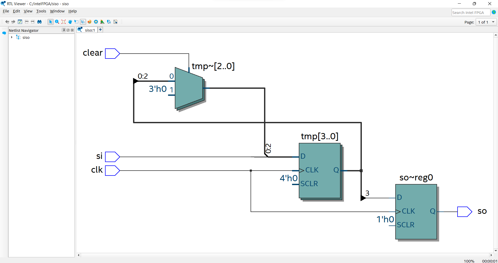
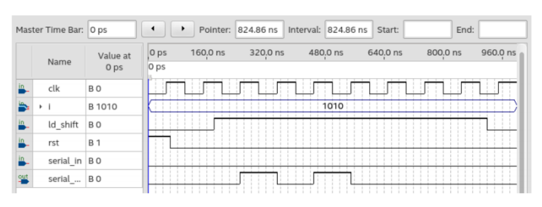

# Experiment--Implementation-of-Serial in -serial out Shift-registers-using-verilog-
### AIM: 
To implement Serial in ,serial out shift Register  using verilog and validating their functionality using their functional tables
### HARDWARE REQUIRED:  –
 PC, Cyclone II , USB flasher
### SOFTWARE REQUIRED:  
 Quartus prime
### THEORY 
Shift registers are basically of 4 types. These are:

Serial In Serial Out shift register

Serial In parallel Out shift register

Parallel In Serial Out shift register

Parallel In parallel Out shift register

### Serial-In Serial-Out Shift Register (SISO) –

The shift register, which allows serial input (one bit after the other through a single data line) and produces a serial output is known as Serial-In Serial-Out shift register. Since there is only one output, the data leaves the shift register one bit at a time in a serial pattern, thus the name Serial-In Serial-Out Shift Register.

The logic circuit given below shows a serial-in serial-out shift register. The circuit consists of four D flip-flops which are connected in a serial manner. All these flip-flops are synchronous with each other since the same clock signal is applied to each flip flop.


### Procedure
Step 1: Create a new file in quartus II.

Step 2: Module Declaration. Module should have the file name.

Step 3: Use begin declaration to define the functionality of logic circuits.

Step 4: Within begin use if statements.

Step 5: At the end give endmodule.

Step 6: Run the program and choose RTL viewer to get RTL realization.


### PROGRAM 
```
Program for  Implementation-of Shift-registers-using-verilog-
Developed by: R.KARTHIKEYAN
RegisterNumber:  22002525

module siso(clk,clear,si,so);
input clk,si,clear;
output so;
reg so;
reg [3:0] tmp;
always @(posedge clk)
begin
if (clear)
tmp<=4'b0000;
else
tmp<=tmp<<1;
tmp[0]<=si;
so =tmp[3];
end 
endmodule


```


### RTL LOGIC  REGISTERS   




### TIMING DIGRAMS FOR SHIFT REGISTERS



### RESULTS 

Implementation of Serial in and Serial out shift Register using verilog and validating their functionality using their functional tables has been successfully completed.